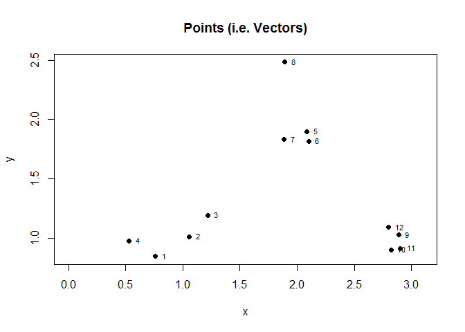
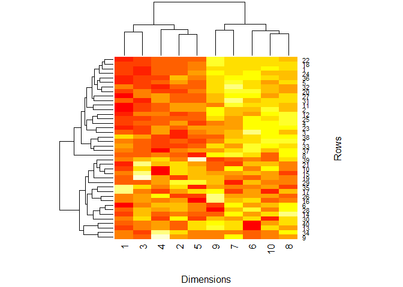

# Hierarchical Clustering


[Clustering](https://en.wikipedia.org/wiki/Cluster_analysis)
is organizing things that are similar to each other into groups.
The definition of "similar" is determined by various algorithms that differ significantly in their notion of what constitutes a cluster and how to efficiently find them. 

[Hierarchical clustering](https://en.wikipedia.org/wiki/Hierarchical_clustering),
also known as **hierarchical cluster analysis**, or **HCA** is a method of cluster analysis
which seeks to build a hierarchy of clusters using one of two general approaches:

- **Agglomerative**: This is a "bottom up" approach: 
each observation starts in its own cluster,
and pairs of clusters are merged as one moves up the hierarchy.
- **Divisive**: This is a "top down" approach: 
all observations start in one cluster,
and splits are performed recursively as one moves down the hierarchy.

In general, the merges and splits are determined in a
[greedy](https://en.wikipedia.org/wiki/Greedy_algorithm) manner
(in other words, it makes locally optimal choices at each stage, in a short-sighted way).
The results of hierarchical clustering are usually presented in a
[dendrogram](https://en.wikipedia.org/wiki/Dendrogram),
i.e. a tree diagram used to illustrate the hierarchical arrangment of clusters,
and may be overlayed with [heatmaps](https://en.wikipedia.org/wiki/Heat_map).

The following R functions for hierarchical clustering are covered herein:

- `dist()`
- `hclust()`
- `cutree()`
- `heatmap()`


```r
set.seed(1234)

# First make some random data that has a pattern
PTS = data.frame(
    x = rnorm( 12, mean=rep(1:3, each=4), sd=0.2 ),
    y = rnorm( 12, mean=rep(c(1,2,1), each=4), sd=0.2 )
)

# Show the points...
plot(PTS$x, PTS$y, xlim=c(0,3.1), pch=19, main="Points (i.e. Vectors)", xlab="x", ylab="y")

# ...and label each point with its corresponding row number in the data frame
text(PTS$x, PTS$y, labels=1:nrow(PTS), cex=.7, pos=4)
```



```r
# dist() is our distance method, and it determines Euclidean distance of the vectors
#   i.e. sqrt( (a1-a2)^2 + (b1-b2)^2 + ... + (z1-z2)^2 )
D <- dist(PTS)
print( round(D, digit=2) )
```

```
##       1    2    3    4    5    6    7    8    9   10   11
## 2  0.34                                                  
## 3  0.57 0.24                                             
## 4  0.26 0.53 0.72                                        
## 5  1.69 1.36 1.12 1.81                                   
## 6  1.66 1.32 1.08 1.78 0.08                              
## 7  1.50 1.17 0.93 1.60 0.21 0.22                         
## 8  1.99 1.69 1.46 2.03 0.62 0.70 0.65                    
## 9  2.14 1.83 1.68 2.36 1.18 1.12 1.29 1.76               
## 10 2.06 1.77 1.63 2.29 1.24 1.17 1.32 1.84 0.14          
## 11 2.15 1.85 1.71 2.37 1.28 1.21 1.37 1.87 0.12 0.08     
## 12 2.06 1.75 1.59 2.27 1.08 1.01 1.18 1.66 0.11 0.19 0.21
```

```r
# hclust() turns the distance matrix into an hclust object
HC = hclust(D)

# Note that rows (i.e. vectors) are the domain, and their hierarchical grouping is the range
plot(HC, xlab="Row Index", ylab="Hierarchical Grouping")
```


```r
# Cutting the tree into k number of branches provides grouping at a specified level
CUT = cutree(HC, k=3)
print(CUT)
```

```
##  [1] 1 1 1 1 2 2 2 2 3 3 3 3
```

```r
# Re-plot our 2D point vectors, but color code based on cluster identifier
plot(PTS$x, PTS$y, xlim=c(0,3.1), pch=19, col=CUT, main="Points Colored by Group", xlab="x", ylab="y")
text(PTS$x, PTS$y, labels=1:nrow(PTS), cex=.7, pos=4)
```


```r
# heatmap() requires a matrix.  Notice that the dimensions are the domain now. 
heatmap( as.matrix(PTS), xlab="Dimensions", ylab="Rows" )
```


```r
# Using a dendrogram + heatmap is more useful for multivariate data.  
# Create a 40 x 10 matrix full of random data.
BIGM = matrix(rnorm(400), nrow=40)
head( round(BIGM, digits=2) )
```

```
##       [,1]  [,2]  [,3] [,4]  [,5]  [,6]  [,7]  [,8]  [,9] [,10]
## [1,] -0.69 -0.01 -0.83 0.51  0.91  0.29  0.34  0.02  0.10  0.84
## [2,] -1.45  1.78  0.17 0.40  1.98 -0.66 -0.67 -0.65  1.16  1.22
## [3,]  0.57 -1.14 -0.90 1.66  1.17  2.92 -0.24 -0.50 -0.76  0.98
## [4,] -1.02  1.37  0.17 0.28 -0.51  0.68 -1.19  1.61 -2.34  0.32
## [5,] -0.02  1.33  0.35 0.51  0.70 -0.68  0.38 -0.45 -0.47 -1.51
## [6,] -0.94  0.34 -0.05 0.35 -0.20  0.19  0.67  0.76 -0.52  0.21
```

```r
# This is too random, so introduce a pattern. 
pattern = rep(c(0,3), each=5)
str(pattern)
```

```
##  num [1:10] 0 0 0 0 0 3 3 3 3 3
```

```r
# Approximately half of the vectors have dimensions 6 through 10 increased significantly.
for (i in 1:40) {
  coinFlip <- rbinom(1, size=1, prob=0.5)
  if (coinFlip) {
    BIGM[i,] = BIGM[i,] + pattern
  }
}

# Now use hierarchical cluster analysis to find the pattern.
# Notice that the dimensions are the domain, and the order of the dimensions is altered
heatmap( BIGM, xlab="Dimensions", ylab="Rows" ) 
```


