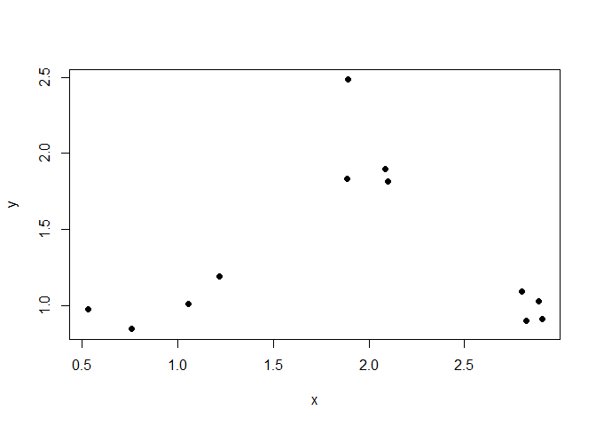
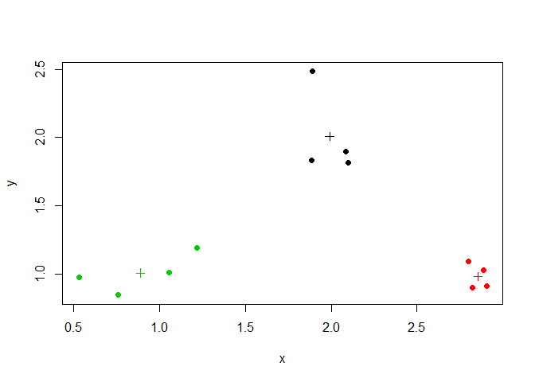

# K Means Clustering


K-Means clustering is good for summarizing high-dimensional data, by means of grouping data points
using a partitioning strategy for K number of clusters.

Warning: this process is **not deterministic** because radomization strategies are included.
This creates different clustering results on different runs if the input data is chaotic.

Each cluster has a **centroid**, and points are assigned into groups around the centroids.

Multiple passes may be made which refine the locations of the centroids as the output of the K-Means cluster algorithm is rerun as the input for the next iteration.  The starting points for the K-Means
cluster algorithm are chosen randomly for the first pass.


```r
set.seed(1234)

# First we shall make some random data that has a pattern too it.
x = rnorm( 12, mean=rep(1:3, each=4), sd=0.2 )
y = rnorm( 12, mean=rep(c(1,2,1), each=4), sd=0.2 )
plot(x, y, pch=19)
```



```r
# Now we do a K-Means Cluster and plot the results.
dataPoints = data.frame(x=x, y=y)
KM = kmeans(dataPoints, centers=3)
names(KM)
```

```
## [1] "cluster"      "centers"      "totss"        "withinss"    
## [5] "tot.withinss" "betweenss"    "size"         "iter"        
## [9] "ifault"
```

```r
plot( x, y, col=KM$cluster, pch=19 )
points( KM$centers, col=1:3, pch=3 )
```



