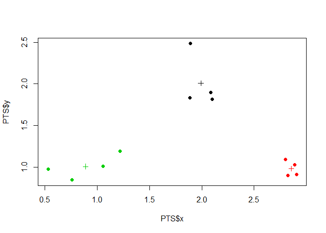

# K Means Clustering


[Clustering](https://en.wikipedia.org/wiki/Cluster_analysis)
is organizing things that are similar to each other into groups.
The definition of "similar" is determined by various algorithms that differ significantly in their notion of what constitutes a cluster and how to efficiently find them. 

[k-means clusting](https://en.wikipedia.org/wiki/K-means_clustering)
aims to partition n observations into k clusters in which each observation 
belongs to the cluster with the nearest mean, serving as a prototype of the cluster.
More pedantically: k-means is a type of 
[vector quantization](https://en.wikipedia.org/wiki/Vector_quantization), 
which is that it allows the modeling of probability density functions by the distribution of prototype vectors.

Each cluster has a **centroid**, and points are assigned into groups around the centroids.

Multiple passes may be made which refine the locations of the centroids as the output of the K-Means cluster algorithm is rerun as the input for the next iteration.  The starting points for the K-Means
cluster algorithm are chosen randomly for the first pass.

Warning: this process is **not deterministic** because radomization strategies are included.
This creates different clustering results on different runs if the input data is chaotic.


```r
set.seed(1234)

# First we shall make some random data that has a pattern.
PTS = data.frame(
    x = rnorm( 12, mean=rep(1:3, each=4), sd=0.2 ),
    y = rnorm( 12, mean=rep(c(1,2,1), each=4), sd=0.2 )
)

plot(PTS$x, PTS$y, pch=19)
```


```r
# Next we create a k-means object.
KM = kmeans(PTS, centers=3)
str(KM)
```

```
## List of 9
##  $ cluster     : int [1:12] 3 3 3 3 1 1 1 1 2 2 ...
##  $ centers     : num [1:3, 1:2] 1.991 2.853 0.89 2.008 0.983 ...
##   ..- attr(*, "dimnames")=List of 2
##   .. ..$ : chr [1:3] "1" "2" "3"
##   .. ..$ : chr [1:2] "x" "y"
##  $ totss       : num 11.2
##  $ withinss    : num [1:3] 0.347 0.033 0.342
##  $ tot.withinss: num 0.722
##  $ betweenss   : num 10.5
##  $ size        : int [1:3] 4 4 4
##  $ iter        : int 2
##  $ ifault      : int 0
##  - attr(*, "class")= chr "kmeans"
```

```r
# Finally we shall plot the data overlayed with k-means cluster data
plot( PTS$x, PTS$y, col=KM$cluster, pch=19 )
points( KM$centers, col=1:3, pch=3 )
```



