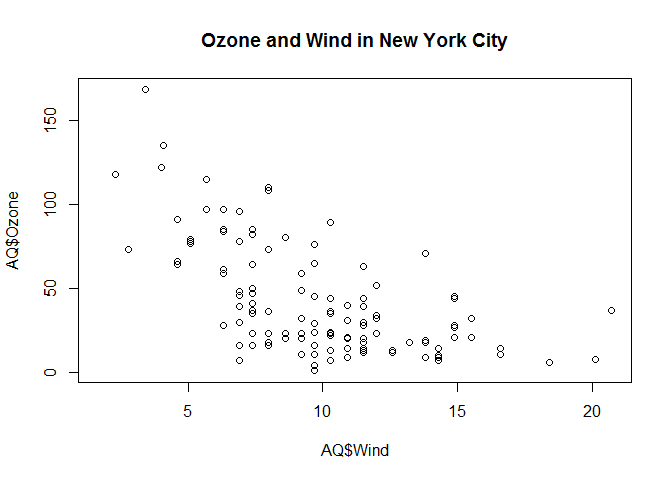
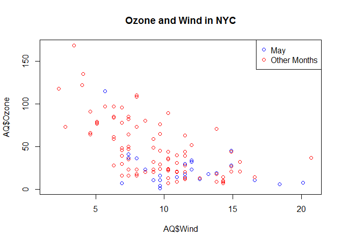
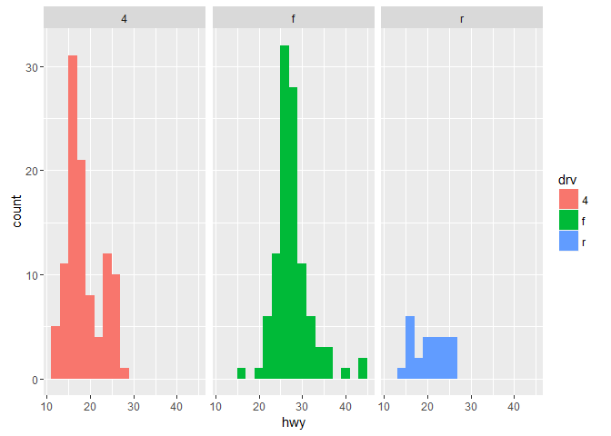
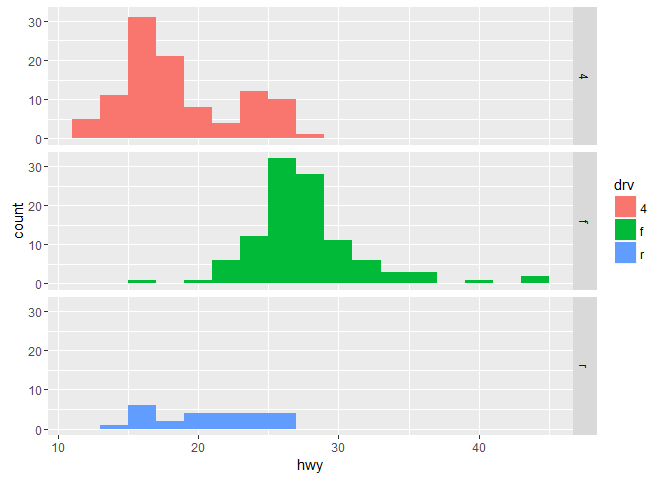

# Plotting


### Base Plot System

Basic plotting methods:

- `hist()`
- `plot()`
- `boxplot()`
- and multiple helpers, like `lines(), points(), text(), title(), mtext(), axis()`

Key plot parameters

- `pch` (i.e. plot char) [pch values](./pch.png)
- `lty` (i.e. line type)
- `lwd` (i.e. line width)
- `col` (i.e. color)
- `xlab` (i.e. x-axis label)
- `ylab` (i.e. y-axis label)

Values for pch:

    

```r
# We will use the airquality data frame for our plotting purposes
library(datasets)
df.AQ = airquality # Short names for data frames are much nicer
str( df.AQ )
```

```
## 'data.frame':	153 obs. of  6 variables:
##  $ Ozone  : int  41 36 12 18 NA 28 23 19 8 NA ...
##  $ Solar.R: int  190 118 149 313 NA NA 299 99 19 194 ...
##  $ Wind   : num  7.4 8 12.6 11.5 14.3 14.9 8.6 13.8 20.1 8.6 ...
##  $ Temp   : int  67 72 74 62 56 66 65 59 61 69 ...
##  $ Month  : int  5 5 5 5 5 5 5 5 5 5 ...
##  $ Day    : int  1 2 3 4 5 6 7 8 9 10 ...
```

[top](#header)

#### Base Histogram


```r
# Draw a histogram
hist( df.AQ$Ozone )
```


[top](#table-of-contents)

#### Base Scatterplot


```r
# Draw a scatterplot
plot( df.AQ$Wind, df.AQ$Ozone )
title( main = "Ozone and Wind in New York City" )
```



[top](#table-of-contents)

#### Scatterplot with Colors


```r
# Create a logical vector to be used as a filter momentarily
is5 = ( df.AQ$Month == 5 )

# Draw a scatterplot again
#   note that type="n" sets up the plot, but does not draw points
plot( df.AQ$Wind, df.AQ$Ozone, main="Ozone and Wind in NYC", type="n" )
points( df.AQ[is5,]$Wind, df.AQ[is5,]$Ozone, col="blue" )
points( df.AQ[!is5,]$Wind, df.AQ[!is5,]$Ozone, col="red" )
legend("topright", pch=1, col=c("blue", "red"), legend=c("May", "Other Months"))
```



[top](#table-of-contents)

#### Scatterplot with Regression Line


```r
# Draw a scatterplot with regression line
plot( df.AQ$Wind, df.AQ$Ozone, main="Ozone and Wind in NYC", pch=20 ) 
model = lm( Ozone ~ Wind, df.AQ )
abline( model, lwd=2 )
```


[top](#table-of-contents)

#### Base Boxplot


```r
# Draw a boxplot
df.AQ$Month = as.factor( df.AQ$Month )
boxplot( Ozone ~ Month, df.AQ, xlab="Month", ylab="Ozone (ppb)" )
```


[top](#table-of-contents)

#### Multiple Base Plots


```r
# Draw multiple plots on single device
par( mfrow = c(1,2) )
plot( df.AQ$Wind, df.AQ$Ozone, main="Ozone and Wind" )
plot( df.AQ$Solar.R, df.AQ$Ozone, main="Ozone and Solar Radiation" )
```


```r
# Set parameter back to single plot
par( mfrow = c(1,1) )
```

[top](#table-of-contents)

### Plotting to Devices

It is possible to manage multiple devices for plotting

- To manage multiple devices, use dev.cur() and dev.set()
- To copy between devices, dev.copy() and dev.copy2pdf()
    

```r
# Draw to a file graphics device instead of default screen graphics device
pdf( file="example.pdf" )
x = rnorm(100)
hist(x)
print( dev.cur() )
```

```
## pdf 
##   3
```

```r
dev.off() #closes file device
```

```
## png 
##   2
```
The PDF is [here.](#example.pdf)

[top](#table-of-contents)

### ggplot2

1. Two main functions: 

    - `qplot()`
    - `ggplot()`
    
2. Main parameters:

    - data, generally a data.frame
    - aesthetic mappings
    - geoms (e.g. points, lines, shapes)
    - facets (i.e. condition)
    - stats (e.g. binning, quantiles, smoothing)
    - scales
    - coord systems
    - labels (e.g. `xlab(), ylab(), ggtitle()`_
    - themes
        - `theme()` for global tweaking
        - general themes e.g. `theme_gray(), theme_bw(), ` ... etc.
        
3. Build using layers:

    - plot data
    - overlay summary
    - metadata and annotation


```r
library(ggplot2) # comes with mpg data set
df.MPG = mpg     # make a copy to play with, using our preferred naming convention
str(df.MPG)
```

```
## Classes 'tbl_df', 'tbl' and 'data.frame':	234 obs. of  11 variables:
##  $ manufacturer: chr  "audi" "audi" "audi" "audi" ...
##  $ model       : chr  "a4" "a4" "a4" "a4" ...
##  $ displ       : num  1.8 1.8 2 2 2.8 2.8 3.1 1.8 1.8 2 ...
##  $ year        : int  1999 1999 2008 2008 1999 1999 2008 1999 1999 2008 ...
##  $ cyl         : int  4 4 4 4 6 6 6 4 4 4 ...
##  $ trans       : chr  "auto(l5)" "manual(m5)" "manual(m6)" "auto(av)" ...
##  $ drv         : chr  "f" "f" "f" "f" ...
##  $ cty         : int  18 21 20 21 16 18 18 18 16 20 ...
##  $ hwy         : int  29 29 31 30 26 26 27 26 25 28 ...
##  $ fl          : chr  "p" "p" "p" "p" ...
##  $ class       : chr  "compact" "compact" "compact" "compact" ...
```

[top](#table-of-contents)

#### qplot


```r
# Scatterplot
p <- qplot(displ, hwy, data = df.MPG)
print(p)
```


```r
# Scatterplot with color codes based on type of drive
p <- qplot(displ, hwy, data = df.MPG, color=drv)
print(p)
```


```r
# add a "smoother" for 95% confidence interval
p <- qplot(displ, hwy, data = df.MPG, geom = c("point", "smooth"))
print(p)
```


```r
# Histogram (inferred by single dimension provided)
#   For all of these histograms, specify a binwidth of bins to avoid warning
p <- qplot(hwy, data = df.MPG, binwidth=2)
print(p)
```


```r
# Histogram with color coding of subsets
p <- qplot(hwy, data = df.MPG, binwidth=2, fill=drv)
print(p)
```


```r
# histogram with facets i.e. panels, in this case spanning HORIZONTALLY
p <- qplot(hwy, data = df.MPG, binwidth=2, fill=drv, facets = . ~ drv)
print(p)
```



```r
# histogram with facets i.e. panels, in this case spanning VERTICALLY
p <- qplot(hwy, data = df.MPG, binwidth=2, fill=drv, facets = drv ~ .)
print(p)
```



[top](#table-of-contents)

#### ggplot


```r
# We will use the airquality dataset for this portion
library(datasets)
df.AQ = airquality
df.AQ$Month = as.factor(df.AQ$Month)
str( df.AQ )
```

```
## 'data.frame':	153 obs. of  6 variables:
##  $ Ozone  : int  41 36 12 18 NA 28 23 19 8 NA ...
##  $ Solar.R: int  190 118 149 313 NA NA 299 99 19 194 ...
##  $ Wind   : num  7.4 8 12.6 11.5 14.3 14.9 8.6 13.8 20.1 8.6 ...
##  $ Temp   : int  67 72 74 62 56 66 65 59 61 69 ...
##  $ Month  : Factor w/ 5 levels "5","6","7","8",..: 1 1 1 1 1 1 1 1 1 1 ...
##  $ Day    : int  1 2 3 4 5 6 7 8 9 10 ...
```

```r
# no actual plot yet, but still has cool summary
p = ggplot( data = df.AQ, aes(Wind,Ozone) )
summary(p)
```

```
## data: Ozone, Solar.R, Wind, Temp, Month, Day [153x6]
## mapping:  x = Wind, y = Ozone
## faceting: facet_null()
```

```r
# now we added a plot
p = ggplot( data = df.AQ, aes(Wind,Ozone) )  
p = p + geom_point()
print(p)
```

```
## Warning: Removed 37 rows containing missing values (geom_point).
```


```r
# add a smoother now
p = ggplot( data = df.AQ, aes(Wind,Ozone) )  
p = p + geom_point()   
p = p + geom_smooth(method = "lm")
print(p)
```

```
## Warning: Removed 37 rows containing non-finite values (stat_smooth).

## Warning: Removed 37 rows containing missing values (geom_point).
```


```r
# now add facets (by month, i.e. condition our plot by month)
p = ggplot( data = df.AQ, aes(Wind,Ozone) )  
p = p + geom_point()   
p = p + geom_smooth(method = "lm")  
p = p + facet_grid(. ~ Month)
print(p)
```

```
## Warning: Removed 37 rows containing non-finite values (stat_smooth).

## Warning: Removed 37 rows containing missing values (geom_point).
```


```r
# add manual limits for fun
p = ggplot( data = df.AQ, aes(Wind,Ozone) )  
p = p + geom_point()   
p = p + geom_smooth(method = "lm")  
p = p + facet_grid(. ~ Month)  
p = p + ylim(-10, 50)
print(p)
```

```
## Warning: Removed 71 rows containing non-finite values (stat_smooth).
```

```
## Warning: Removed 71 rows containing missing values (geom_point).
```


```r
# How to condition (i.e. add facets) for continuous data?  use the cut() function to add column
# lets condition on Temp instead of Month
cutpoints <- quantile(df.AQ$Temp, seq(0,1, length=4), na.rm=TRUE)
df.AQ$TempDec <- cut(df.AQ$Temp, cutpoints)
levels(df.AQ$TempDec)
```

```
## [1] "(56,75]" "(75,82]" "(82,97]"
```

```r
# Now we can plot
p = ggplot( data = df.AQ, aes(Wind,Ozone) )  
p = p + geom_point()   
p = p + geom_smooth(method = "lm")  
p = p + facet_grid(. ~ Month)
print(p)
```

```
## Warning: Removed 37 rows containing non-finite values (stat_smooth).
```

```
## Warning: Removed 37 rows containing missing values (geom_point).
```


```r
# Create a 2-dimensional facet and condition on month and tempurature decile
p = ggplot( data = df.AQ, aes(Wind,Ozone) )  
p = p + geom_point()   
p = p + geom_smooth(method = "lm")  
p = p + facet_grid(Month ~ TempDec)
print(p)
```

```
## Warning: Removed 37 rows containing non-finite values (stat_smooth).
```

```
## Warning in qt((1 - level)/2, df): NaNs produced

## Warning in qt((1 - level)/2, df): NaNs produced
```

```
## Warning: Removed 37 rows containing missing values (geom_point).
```


[top](#table-of-contents)
