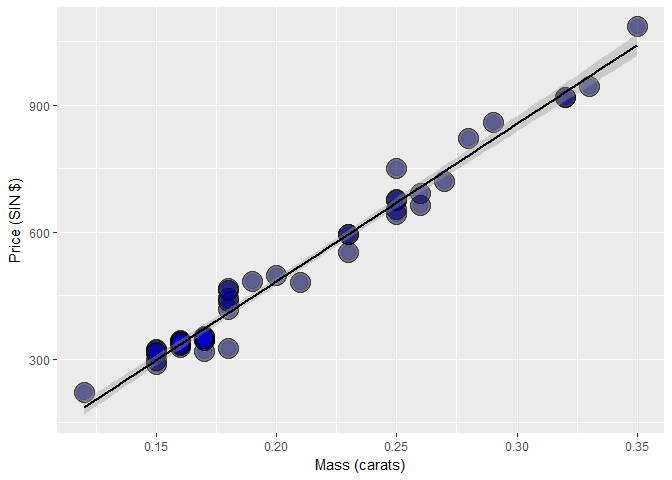

# Linear Regression and Multivariable Regression

See https://leanpub.com/regmods

And https://github.com/bcaffo/courses/blob/master/07_RegressionModels/


## Statisitcal Linear Regression Models - Add Gaussian errors

Consider developing a probabilistic model for linear regression $$ Y_i = \beta_0 + \beta_1 X_i + \epsilon_{i} $$

Here the $\epsilon_{i}$ are assumed iid $N(0, \sigma^2)$. 

  - *remember N(u,v) is a normal distribution*

Note, $E[Y_i ~|~ X_i = x_i] = \mu_i = \beta_0 + \beta_1 x_i$ 

  - *remember E[x] is expected value*

Note, $Var(Y_i ~|~ X_i = x_i) = \sigma^2$. 

  - *this is the variance around the regression line, not the variance of the response.  it will be **lower** than the response itself because you have explained away some of the variation with X by conditioning on X*
  
## Interpreting Coeffecients

$\beta_0$ is the expected value of the response when the predictor is 0 $$ E[Y | X = 0] = \beta_0 + \beta_1 \times 0 = \beta_0 $$

Note, this isn't always of interest, for example when $X=0$ is impossible or far outside of the range of data. (X is blood pressure, or height etc.)

Consider that $$ Y_i = \beta_0 + \beta_1 X_i + \epsilon_i = \beta_0 + a \beta_1 + \beta_1 (X_i - a) + \epsilon_i = \tilde \beta_0 + \beta_1 (X_i - a) + \epsilon_i $$ So, shifting your $X$ values by value $a$ changes the intercept, but not the slope.

Often $a$ is set to $\bar X$ so that the intercept is interpretted as the expected response at the average $X$ value.

$\beta_1$ is the expected change in response for a 1 unit change in the predictor $$ E[Y ~|~ X = x+1] - E[Y ~|~ X = x] = \beta_0 + \beta_1 (x + 1) - (\beta_0 + \beta_1 x ) = \beta_1 $$

Consider the impact of changing the units of $X$. $$ Y_i = \beta_0 + \beta_1 X_i + \epsilon_i = \beta_0 + \frac{\beta_1}{a} (X_i a) + \epsilon_i = \beta_0 + \tilde \beta_1 (X_i a) + \epsilon_i $$

Therefore, multiplication of $X$ by a factor $a$ results in dividing the coefficient by a factor of $a$.

Example: $X$ is height in $m$ and $Y$ is weight in $kg$. Then $\beta_1$ is $kg/m$. Converting $X$ to $cm$ implies multiplying $X$ by $100 cm/m$. To get $\beta_1$ in the right units, we have to divide by $100 cm /m$ to get it to have the right units. $$ X m \times \frac{100cm}{m} = (100 X) cm \mbox{and} \beta_1 \frac{kg}{m} \times\frac{1 m}{100cm} = \left(\frac{\beta_1}{100}\right)\frac{kg}{cm} $$

## Linear Regression for Prediction

Lets do some code


```r
library(UsingR)
library(dplyr)
library(ggplot2)

data(diamond)
head(diamond)
```

```
##   carat price
## 1  0.17   355
## 2  0.16   328
## 3  0.17   350
## 4  0.18   325
## 5  0.25   642
## 6  0.16   342
```

```r
fit = lm(price ~ carat, data = diamond)
coef(fit)
```

```
## (Intercept)       carat 
##   -259.6259   3721.0249
```

```r
g = ggplot(diamond, aes(x = carat, y = price))
g = g + xlab("Mass (carats)")
g = g + ylab("Price (SIN $)")
g = g + geom_point(size = 7, colour = "black", alpha=0.5)
g = g + geom_point(size = 5, colour = "blue", alpha=0.2)
g = g + geom_smooth(method = "lm", colour = "black")
g
```

<!-- -->

Cool, but the Y-intercept is -259 for a 0 carat diamond, which is nonsense.  Let's mean-center our data, or in other words: change the meaning of the intercept from "what is the expected value at 0?" to "what is the expected value at u?"


```r
# Notice we can do arithmetic within our formula, but we need to surround it with th I() function
#  (I stands for Inhibit interpretation/conversion of objects)
fit2 = lm(price ~ I(carat - mean(carat)), data = diamond)
coef(fit2)
```

```
##            (Intercept) I(carat - mean(carat)) 
##               500.0833              3721.0249
```

OK, but since a carat is actually a large value, lets change the units to 1/10th of a carat.  To do this, we need to **multiply** the value in formula by 10


```r
fit3 = lm(price ~ I(carat * 10), data = diamond)
coef(fit3)
```

```
##   (Intercept) I(carat * 10) 
##     -259.6259      372.1025
```

## Predict

Given our fit, lets use it to predict the value of some new diamonds.


```r
fit = lm(price ~ carat, data = diamond)
newx = c(0.16, 0.27, 0.34)
predict(fit, newdata = data.frame(carat = newx))
```

```
##         1         2         3 
##  335.7381  745.0508 1005.5225
```

## Residuals

Residuals represent variation left unexplained by our model. We emphasize the difference between residuals and errors. The errors unobservable true errors from the known coefficients, while residuals are the observable errors from the estimated coefficients. In a sense, the residuals are estimates of the errors.

I.e. residual variation around the trend line.

You may think of the residual values as the values of the outcomes Y if you remove the linear component influence of the regressors X.
