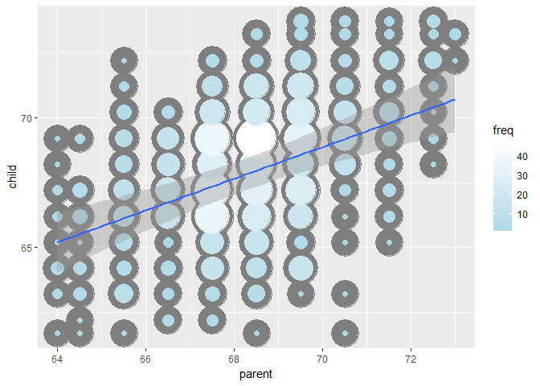
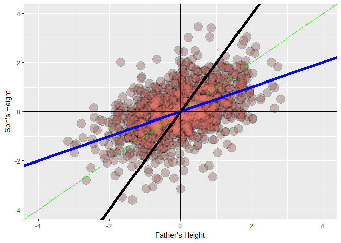

# Least Squares and Linear Regression

See https://leanpub.com/regmods

And https://github.com/bcaffo/courses/blob/master/07_RegressionModels/

## Sample Data


```r
library(UsingR)
library(dplyr)
library(ggplot2)

data(galton)
head(galton)
```

```
##   child parent
## 1  61.7   70.5
## 2  61.7   68.5
## 3  61.7   65.5
## 4  61.7   64.5
## 5  61.7   64.0
## 6  62.2   67.5
```

## Basic Idea

Assume we have a data set with two vectors X and Y, and we would like to find a model that uses X to predict Y.  In other words, we have Y = f(X).

To do basic linear regression, we are looking for a line of best fit (i.e. y = a + bx).  The two coefficients  that we are looking for (a,b) are the Y intercept and the slope.  To calculate these values, here's a few quick statistical formulas to refresh yourself

## The Emprical Variance (Stand Dev is its square root)
$$
S^2 = \frac{1}{n-1} \sum_{i=1}^n (X_i - \bar X)^2 
= \frac{1}{n-1} \left( \sum_{i=1}^n X_i^2 - n \bar X ^ 2 \right)
$$

## The Empirical Covariance and Correlation
Consider now when we have pairs of data, $(X_i, Y_i)$.  Their empirical covariance is 
$$
Cov(X, Y) = 
\frac{1}{n-1}\sum_{i=1}^n (X_i - \bar X) (Y_i - \bar Y)
= \frac{1}{n-1}\left( \sum_{i=1}^n X_i Y_i - n \bar X \bar Y\right)
$$
The correlation is defined is
$$
Cor(X, Y) = \frac{Cov(X, Y)}{S_x S_y}
$$
Note that the Greek letter rho ($\rho$) is commonly used to represent correlation

## Finding Intercept and Slope for Line of Best Fit
The line passes through the point $(\bar X, \bar Y$)

The slope of the regression line with $X$ as the outcome and $Y$ as the predictor is $Cor(Y, X) Sd(X)/ Sd(Y)$. 

Let's calculate it

```r
y <- galton$child
x <- galton$parent
beta1 <- cor(y, x) *  sd(y) / sd(x)
beta0 <- mean(y) - beta1 * mean(x)
c(beta0, beta1)
```

```
## [1] 23.9415302  0.6462906
```

R has a function called lm() to do this for use (i.e. Linear Model)


```r
lm(y ~ x)
```

```
## 
## Call:
## lm(formula = y ~ x)
## 
## Coefficients:
## (Intercept)            x  
##     23.9415       0.6463
```

```r
# Note that you can force the line to fit through the origin (0,0)
lm(y ~ x - 1)
```

```
## 
## Call:
## lm(formula = y ~ x - 1)
## 
## Coefficients:
##      x  
## 0.9965
```

## Plotting with ggplot (Use geom_smooth with method=lm)


```r
freqData <- as.data.frame(table(galton$child, galton$parent))
names(freqData) <- c("child", "parent", "freq")
freqData$child <- as.numeric(as.character(freqData$child))
freqData$parent <- as.numeric(as.character(freqData$parent))

g <- ggplot(filter(freqData, freq > 0), aes(x = parent, y = child))
g <- g  + scale_size(range = c(2, 20), guide = "none" )
g <- g + geom_point(colour="grey50", aes(size = freq+20, show_guide = FALSE))
```

```
## Warning: Ignoring unknown aesthetics: show_guide
```

```r
g <- g + geom_point(aes(colour=freq, size = freq))
g <- g + scale_colour_gradient(low = "lightblue", high="white")  
g <- g + geom_smooth(method="lm", formula=y~x)
g
```

<!-- -->

## Regression to the Mean

ather's height is X variable, and son's height is Y variable.  The data is normalized, and this means that if the data had no noise, then all of the data points would fall on the identity line (green).  If the data was entirely noise, then the all data points would fall on the x-axis (i.e. the std dev of all Y values would be zero, indicating the exact center of a normal distribution), however in our model, we see that the blue line which shows our line of best fit has been skewed by noise.  Notice that it   


```r
data(father.son)
y <- (father.son$sheight - mean(father.son$sheight)) / sd(father.son$sheight)
x <- (father.son$fheight - mean(father.son$fheight)) / sd(father.son$fheight)
rho <- cor(x, y)

g = ggplot(data.frame(x = x, y = y), aes(x = x, y = y))
g = g + geom_point(size = 6, colour = "black", alpha = 0.2)
g = g + geom_point(size = 4, colour = "salmon", alpha = 0.2)
g = g + xlim(-4, 4) + ylim(-4, 4)
g = g + labs(x = "Father's Height", y = "Son's Height")

g = g + geom_abline(intercept = 0, slope = 1, colour = "green")
g = g + geom_vline(xintercept = 0)
g = g + geom_hline(yintercept = 0)
g = g + geom_abline(intercept = 0, slope = rho, size = 2, colour="blue")
g = g + geom_abline(intercept = 0, slope = 1 / rho, size = 2)
g
```

<!-- -->


